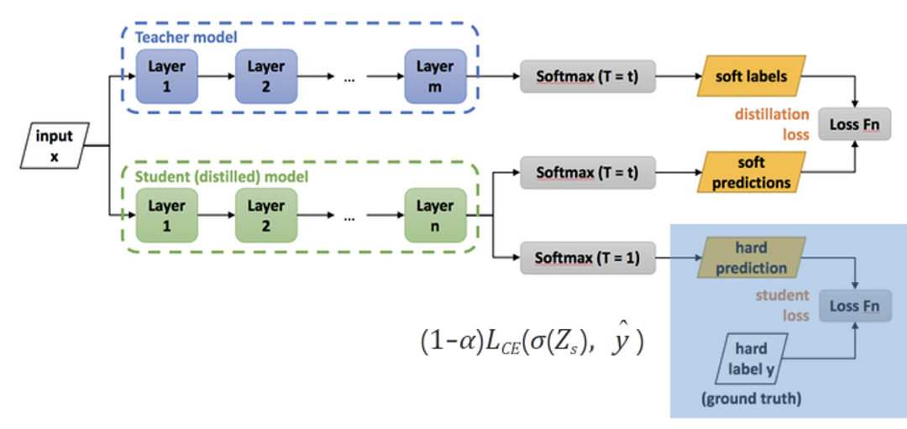
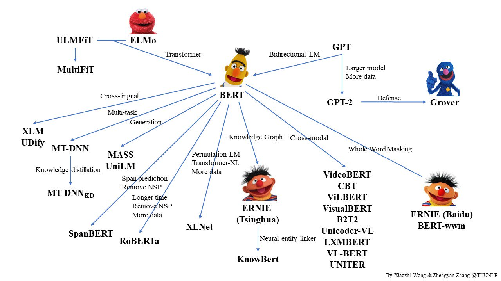
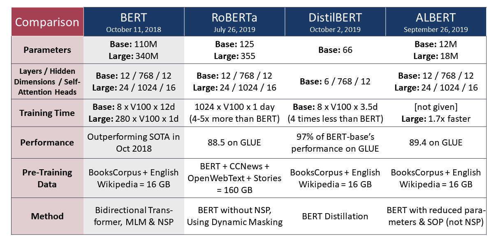

# DistilBERT :  a, distilled version of BERT : smaller, faster, cheaper, lighter

## Keywords

`knowledge Distillation`; `inductive bias`; `triple loss`; `cosine distance`; `soft label`;

## Background Knowledge

- `Knowledge Distillation` : big model 의 엑기스(귀요미) 버전!!
    
    "Distilling the Knowledge in a Neural Network" 라는 논문에서 제시된 개념
    
    - 미리 잘 학습된 큰 네트워크(Teacher network) 의 지식을 실제로 사용하고자 하는 작은 네트워크(Student network) 에게 전달하는 것 — 새로운 objective 를 제안한 거!!
    - 딥러닝 모델은 보편적으로 넓고 깊어서 파라미터 수가 많고 연산량이 많으면 feature extraction 이 더 잘 되고, 그에 따라서 모델의 목적인 Classification 이나 Object detection 등의 성능 또한 좋아짐
    - 작은 모델로 더 큰 모델만큼의 성능을 얻을 수 있다면, Computing resource(GPU 와 CPU), Energy(배터리 등), Memory 측면에서 더 효율적
        
        

            🤔흠... teacher & student 모델로 나눠 놓은게 흥미롭네
        
        
        
            식이 좀 잘못 된 거 같네..
        
        
        
    - 두 네트워크의 분류 결과를 비교하기 위해서 Hard label 이 아닌 Soft label 을 사용하고 있음
        - 저기서 T 가 온도(hyperparameter) : 온도가 높을수로 Softer, 낮을수록 Harder…. 재밌네
        
        

            왼쪽이 hard label, 오른쪽이 soft label
        
        
        
    - `Knowledge distillation` 은 미리 학습시킨 Teacher network 의 출력을 내가 실제로 사용하고자 하는 작은 모델인 Student network 가 모방하여 학습함으로써, 상대적으로 적은 Parameter 를 가지고 있더라도 모델의 성능을 높이는 방법론
    - 자세한 설명은 [https://light-tree.tistory.com/196](https://light-tree.tistory.com/196)  [https://intellabs.github.io/distiller/schedule.html#knowledge-distillation](https://intellabs.github.io/distiller/schedule.html#knowledge-distillation) 참조하세용~~
    
- what is bias & variance, `inductive bias` in Machine Learning
    
    
    
    
    
    각각 편차와 분산을 의미하며, 머신러닝에서 biased 라는 것은 train error - baseyan error(human error) 의 차이가 크고, high variance 는 train error - dev error 의 간극이 큼을 뜻한다. 각각의 상황을 high bias (underfit), high variance (overfit) 한 상태라 말하고 일반적으로 다음과 같이 해결한다.
    
    - high bias (underfit) : 학습조차 제대로 안된 상태
        - 모델을 키워 더 deep 하게 만들거나
        - 학습을 더 오래시킨다
    - high variance (overfit) : 과한 학습으로 낯선 데이터에 예측 성능 떨어짐
        - 더 많은 데이터
        - 정규화(regularization)
    
    방법으로 해결할 수 있다.
    
    다만, ML 의 도메인에 따라 모델의 특성이 결정되므로, 특정 도메인의 문제를 해결하기 위해서는 task를 이해하고 이에 적합한 해결책을 제시하는 것이 더 효과적일 것이다. 이를 설명하는 것이 `inductive bias` 이다.
    
    모델을 설계하기 전에 위에서 제시된 것과 같은 일반적인(일어날 법한) 문제를 미리 가정할 수 있다. 즉, `inductive bias` 는 특정 도메인(task)에서 일어날 법한 문제나 데이터를 미리 가정한 것들의 집합이다.
    
- `Cosine Distance`
    
    $$
    ⁍
    $$
    
    $$
    d_{cosine}(X,Y)=1-cosine\;similarity
    $$
    
    |  | Life | Love | Learn |
    | --- | --- | --- | --- |
    | doc1 | 1 | 0 | 5 |
    | doc2 | 4 | 7 | 3 |
    | doc3 | 40 | 70 | 30 |
    
    $$
    \begin{align*}
    &\;\;\;\;\;d_{cosine}(doc1,doc2)\\
    &=1-\frac{[\textmd{Life1,Love1,Learn1}]\cdot[\textmd{Life2,Love2,Learn2}]}{||[\textmd{Life1,Love1,Learn1}]||_2\cdot ||[\textmd{Life2,Love2,Learn2}]||_2}\\
    &=1-\frac{1\cdot4+0\cdot4+5\cdot3}{\sqrt{1^2+0^2+5^2}\cdot \sqrt{4^2+7^2+3^2}}\\
    &=1-\frac{19}{\sqrt{26}\cdot\sqrt{74}}
    
    \end{align*}
    $$
    

## Abstract

기존의 pretrain-model 은 모델의 크기가 매우 커서 컴퓨터의 성능이 모델의 성능을 결정했음

→ 즉, 장비가 우수함==비쌈

그래서 smaller faster cheaper lighter 한 distilBERT 모델을 개발했다. 

해당 모델에는 `inductive bias` 의 영향력을 키우기 위해 세가지 `loss` + `language modeling`를 활용했다. `distillation` + `consine-distance loss`

위와 같은 장점으로

- 기존 BERT 의 0.4배 (파라미터), 97%성능 유지, 1.6배 더 빠름
    - experiment 에서 확인해야 할 것
- on-device level 에서 실험

## Introduction


      SOTA 급 모델의 크기를 확인할 수 있다. 겁나 크다.

NLP 에 전이학습(transfer learning)을 적용시키는 시도가 엄청 많았다.

> 여기서 말하는 전이학습 : pretrain 레벨에서 parameter 학습시키고 downstream level 의 서로 다른 task에 적용 (parmeter 을 거의 그대로 사용)
> 

크기가 커질수록 성능이 증가하는 추세를 확인할 수 있다.

근데 크기가 너무 크다. (100 million = 100000000 = 1억개 parameter)

- 자연 환경적 문제
    - 1개의 Transformer를 학습할 때 발생하는 이산화탄소 배출량은 차량 한대가 평생 발생시키는 것의 약 5배에 이른다는 실험 결과이다.
    - (이건 좀 재밌는 관점이네요~~ Green AI 참조) [https://smilegate.ai/2021/10/31/green-ai/](https://smilegate.ai/2021/10/31/green-ai/)
- on-device : 핸드폰이나 가전제품 같은거 에 적용 불가
    - 다양한 적용에 제한이 된다 : 상업적으로 활용하기 힘들다

결국 2가지 문제 모두 하드웨어 측면에서 모델의 크기를 감당하지 힘들다는 것을 지적

이를 해결하기 위해

- `Knowledge distillation` 적용
    - 가벼워지고 빨라지고
    - 하드웨어 성능에서 꽤나 독립
        - 다양한 application 가능 : 스마트폰 같은 거
            - on-device 에서는 train 필요없고, 그에 의한 artifacts(parameters) 만 필요하기 때문에
            - parameter 개수만 줄이면 된다!!
- `triplet loss` 적용
    - 0.4 크기의 transformer (’Attention is all you need’ 것의)
    - 근데 1.6배 더 빨라졌음
        - 이거는 ablation experiment (기술 + - 성능 차이) 에서 확인하자
        

## Knowledge Distillation

teacher model 과 student model 로 이루어져 있음

→ student mode 이 larger model(teacher model)에서 파라미터를 조금 다르게 학습

읭 gold label(?) : calling hand-labeled data as "gold" labels

A model performing well on the training set will predict an output distribution with high probability on the correct class and with near-zero probabilities on other classes. But some of these "near-zero" probabilities are larger than others and reflect, in part, the generalization capabilities of the model and how well it will perform on the test set.

→ 아래 나올 설명 soft label에 대한 빌드업

`BERT`의 `mlm`: $\texttt{I think this is the beginning of beautiful [MASK].}$

- 정답-train set (high probability tokens) :
    - $\texttt{[day,life]}$ 에 `overfit` 하지 않기 위해
- 정답은 아니지만 “유효(valid, test set의 답이 될 수 있는)” (near-zero tokens)
    - $\texttt{[future,story,world,...]}$ 에 대한 generalization 필요

즉, `knowledge distillation` 과 `BERT` 의 `inductive bias` 를 강화시키기 위해서 `soft label` 도입

```python
loss_ce = (
            self.ce_loss_fct(
                nn.functional.log_softmax(s_logits_slct / self.temperature, dim=-1),
                nn.functional.softmax(t_logits_slct / self.temperature, dim=-1),
            )
            * (self.temperature) ** 2
        )ㅂ
loss = self.alpha_ce * loss_ce
```

## Architecture

- Student architecture
    - BERT 랑 거의 같고 사이즈만 다름
        - 레이어의 수가 반으로 줄었다!
            - pooling, token type embeddings 가 제거되었음
            - 텐서(다차원 행렬)의 $\texttt{.shape[-1]}$의 최적화보다 더 효과적(인사이트 얻었다 하네)
                - 이미 Tranformer 아키텍쳐가 선형대수적으로 높은 수준의 최적화 달성해있어서
                - 그런 matrix 적인 최적화가 별로 효과적이지 못했다는 말
                
- Student initialization
    - 여기서 의미하는 converge 의 의미가 뭔지 모르겠다…
    
- Distillation
    - batch 크기 결정시 BERT 에서 가장 효과적이었던 방식 적용
        - gradient caching 에 효과적이도록 매우 큰 batch size (~4K)
        - dynamic masking 에다가 NSP 는 빼버렸다
            - NSP 는 논란이 많았거덩…
            
- Data and compute power
    - BERT 와 같은 train data (corpus) 사용
        - `The corpus=concat(English Wikipedia,Tronto Book Corpus)`
        - 8*16GB V100 GPU 로 약 90시간 대조군으로 RoBERTa : 1024*32GB V100
            
        
            
            싼거 맞냐??
            
        

## Experiments


    GLUE : score 합산 시 대충 97% 성능


    downstream task(transfer learning)에서도 우수함      
    parmeter 수가 거의 반타작났다. 시간도 0.6배 정도


## On device computation

- edge computing 의 가능성
    - iphone 7+ 상에서 BERT와 성능 비교, task는 QA
        - tokenization 빼고 봤을 때 71% 빠르고 용량 207MB 으로 가벼움

> Our code is available 👏👏👏
> 

## Conclusion and future work

- 40% 작고, 60% 빠르고, 97% 성능유지
- general task(범용적) 에 `distillation` 적용가능한 거 보여줬지
- edge application 에 적용가능한 거 보여줬지

## BERT 는 알차다

BERT 발표된 후, 다양한 버전의 -BERT 가 만들어짐



일종의 패러다임을 형성해서 진짜

            골수까지 쪽쪽 빨아먹을 정도로 자주 활용되었다.
     다음과 같은 이유로 많이 쓰이진 않았을까?

- 단순한 모델
    - GPT 나 다른 모델에 비해서 모델이 단순한
    - 것에 비해 우월한 성능을 자랑
    - 이걸 조금만 수정하면 ‘야나두' 마냥 성공 가능성
- 단순하기 때문에 개선될 여지
    - downstream task 에 fit 하는 작업이 없어서(undertrained)
    - 아마 다른 개발자들이 하이에나 마냥 달려들었을 거다
- 눈에 보이는 문제점
    - MLM : corrupted sentences
    - NSP : corrupted context
    



    RoBERTa 랑 DistilBERT parameter 에 m 빠짐
